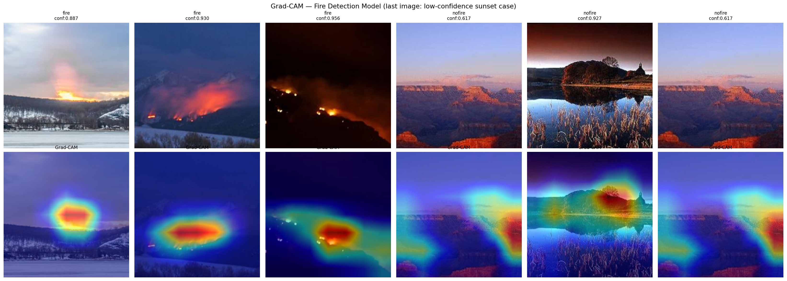
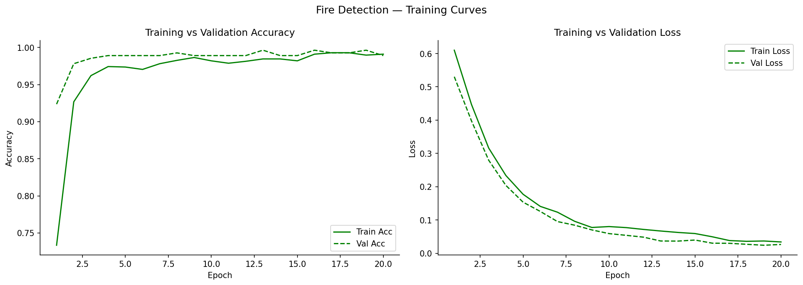
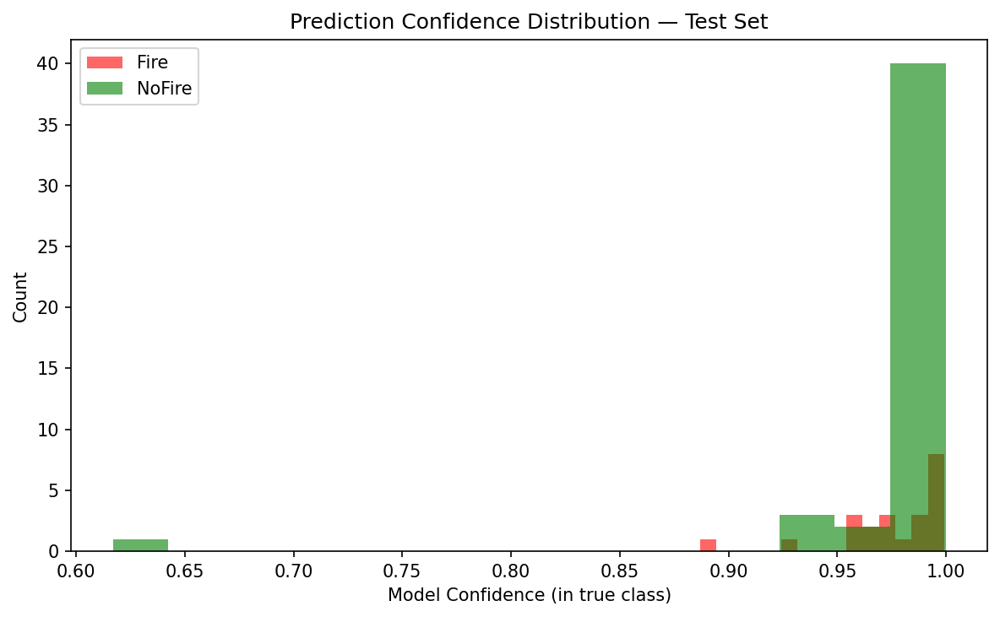
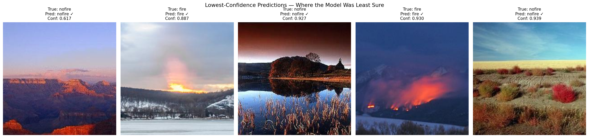
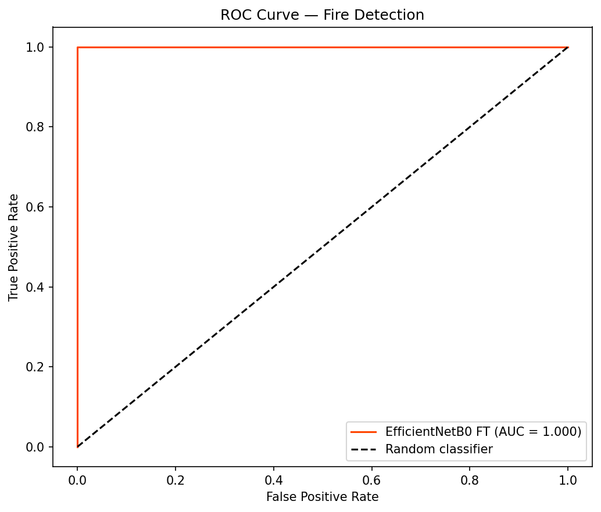

# Wildfire Detection — Two Models, One Critical Lesson
### Satellite Land-Use Shortcut vs Genuine Visual Fire Detection

   

---

## Project Overview

This repository contains **two paired wildfire detection projects** that together
tell a critical story about evaluating deep learning models in high-stakes
environmental domains:

1. **Satellite Imagery Model** — achieved 99.48% accuracy, but Grad-CAM
   investigation revealed it had learned to distinguish **forest from suburban
   land-use**, not actual fire damage. A textbook case of shortcut learning.

2. **Visual Fire Detection Model** — achieved 100% accuracy on real fire/smoke
   imagery, with interpretability analysis confirming it genuinely attends to
   **flames, smoke plumes, and fire-related visual evidence**.

> *Two models, both reporting near-perfect accuracy — but only one of them
> actually does what its name claims.*

This pairing demonstrates that **accuracy alone cannot validate a model** —
interpretability analysis and careful interrogation of confidence patterns are
essential, especially for high-stakes environmental and clinical applications.

---

## Environmental Context

Wildfires are increasing in frequency and severity globally due to climate
change, making early detection and accurate risk assessment a critical research
area. Two distinct approaches exist in this space: predicting *where* fires are
likely (geographic/terrain risk modelling) and detecting *when* a fire is
actively occurring (visual fire/smoke detection). This project explores both —
and reveals why conflating the two without careful validation is dangerous.

---

## Project 1: Satellite Imagery (Land-Use Shortcut)

### Dataset
| Property | Detail |
|----------|--------|
| Source | [Kaggle — Wildfire Prediction Dataset](https://www.kaggle.com/datasets/abdelghaniaaba/wildfire-prediction-dataset) |
| Total images | 42,850 (350×350px satellite images) |
| Classes | wildfire (22,710) / nowildfire (20,140) |
| Label source | Coordinates of areas that previously experienced wildfires |

### Model
EfficientNetB0, fine-tuned (last 5 of 9 blocks unfrozen), 3.9M trainable parameters, 10 epochs.

### Result: 99.48% Validation Accuracy — But It's Misleading

| Evidence | Finding |
|----------|---------|
| Mean confidence on correct predictions | 99.82% — unusually decisive |
| Grad-CAM on "nowildfire" predictions | Focuses on roads, suburban housing patterns, water bodies |
| Grad-CAM on "wildfire" predictions | Focuses on generic forest/rural terrain texture, not burn scars |
| Misclassifications | Only 22/6,300 — evenly split, no informative pattern |

**Conclusion:** The model learned to distinguish **forest/rural terrain from
suburban/urban development** — not wildfire risk or damage. Because this
dataset's wildfire images happen to come from forested regions and
no-wildfire images from more developed regions, this land-use shortcut
achieves near-perfect accuracy while learning nothing about actual fire
indicators.

*Grad-CAM reveals attention on roads and suburban layouts (nowildfire) vs generic forest texture (wildfire) — not fire-specific evidence.*

---

## Project 2: Visual Fire Detection (Genuine Signal)

### Dataset
| Property | Detail |
|----------|--------|
| Source | [Kaggle — Wildfire Detection Image Data](https://www.kaggle.com/datasets/brsdincer/wildfire-detection-image-data) |
| Total images | 1,900 (varied day/night, near/far conditions) |
| Classes | fire (928 train+val / 22 test) / nofire (904 train+val / 46 test) |
| Label source | Actual photographs showing visible fire, smoke, or flame |

### Model
EfficientNetB0, fine-tuned (last 3 of 9 blocks unfrozen), 3.2M trainable parameters, 20 epochs, lr=1e-5.

### Result: 100% Test Accuracy — Supported by Evidence

| Evidence | Finding |
|----------|---------|
| Learning curve | Smooth, gradual improvement over 20 epochs — no shortcut-like instant jump |
| Mean confidence | ~97-98% — realistic, not artificially saturated |
| Lowest confidence case | 61.7% — a sunset canyon scene with fire-like orange lighting |
| Grad-CAM on fire images | Focuses precisely on smoke plumes and flame regions |
| Grad-CAM on hardest nofire case | Focuses on rock/landscape structure, not just warm colour |

**Conclusion:** This model genuinely detects fire-related visual evidence.
Its lowest-confidence cases are exactly where a human would expect ambiguity
(sunset lighting resembling fire glow), and even then it remains correct —
appropriately uncertain rather than falsely confident.

*Grad-CAM confirms attention on actual smoke/flame regions for fire images, and on structural landscape features (not colour alone) for the hardest nofire case.*

### Supporting Visualisations

---

## Side-by-Side Comparison

| | Satellite Project | Visual Fire Project |
|---|---|---|
| Test/Val accuracy | 99.48% | 100% |
| What the model actually learned | Land-use/terrain type | Fire/smoke visual features |
| Mean prediction confidence | 99.82% | ~97-98% |
| Confidence distribution shape | Sharp single spike | Spread, realistic uncertainty |
| Hardest cases identified | None — uniformly confident | Sunset/dusk scenes — appropriately less confident |
| Grad-CAM focus | Roads, buildings, terrain texture | Smoke plumes, flames, fire glow |
| Verdict | ❌ Shortcut learning (dataset bias) | ✅ Genuine fire detection |

---

## Key Takeaway

High accuracy is not evidence of a correct model — it is evidence that
**something** in the data predicts the label well. Whether that something is
the thing you actually care about requires deliberate investigation:

1. Question results that seem unusually good for the task's apparent difficulty
2. Use interpretability tools (Grad-CAM) to verify the model attends to
   task-relevant evidence, not incidental correlates
3. Examine confidence distributions, not just point accuracy — realistic
   uncertainty on genuinely hard cases is a positive signal, not a weakness
4. Understand how a dataset was constructed — label provenance can introduce
   confounds invisible from the images alone

This principle applies directly to high-stakes domains like medical imaging
(see companion HAM10000 skin cancer projects) and environmental monitoring —
anywhere a wrong but confident model could cause real harm if deployed.

---

## Limitations

**Satellite project:**
- Findings are specific to this dataset's construction method; other satellite
  wildfire datasets with paired before/after imagery of the same location
  would avoid this confound

**Fire detection project:**
- Small test set (n=68) — 100% accuracy should be validated on a larger
  held-out set before being treated as a robust performance estimate
- Dataset sourced from varied online images, not a controlled collection —
  may not generalise to drone or fixed CCTV camera footage used in real
  deployment scenarios
- Binary fire/nofire only — no early-stage smoke-only detection, which is the
  most operationally valuable capability for early warning systems
